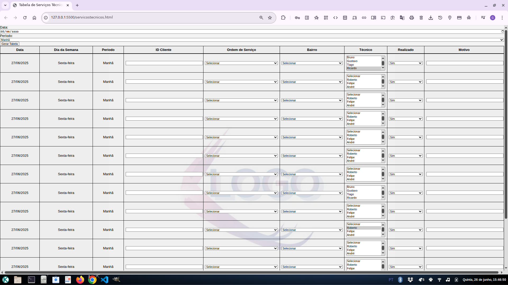

# Minha Tabela de Ordens de Serviço 📋✨

Oiê! 👋

Esta ferramenta foi criada para facilitar o gerenciamento de Ordens de Serviço em provedores de internet e telecomunicações que ainda operam com processos manuais, baseados em registros em papel. Muitas equipes técnicas e de atendimento enfrentam dificuldades para organizar, acompanhar e consultar as demandas do dia a dia de forma ágil e segura.

A proposta da tabela é oferecer uma solução digital simples, que armazena localmente as informações no navegador do usuário, garantindo que os dados estejam sempre disponíveis mesmo após o fechamento da aba ou do computador. Assim, o projeto ajuda a dar o primeiro passo na digitalização do processo, sem a complexidade ou custo de sistemas automatizados robustos. 💾💡

E não é que a mágica aconteceu?

### 🚀 Os Superpoderes desta Tabela

* 🧠 **Armazenamento Local:** Usa a API localStorage para salvar e recuperar todas as informações automaticamente

* ✍️ **Listas Prontas:** Técnicos, bairros e tipos de serviço disponíveis para seleção rápida, evitando retrabalho.

* 🪄**Tabela Dinâmica:** A tabela se monta automaticamente com base na data escolhida, pronta para receber as ordens do dia.o dia.

### 🧐 Um Pequeno Detalhe...

Por enquanto,brilha mais em telas de computador (desktops e notebooks). Ela ainda não aprendeu os truques para se adaptar perfeitamente a telas pequeninas de celular.

### 🛠️ Minha Caixa de Ferramentas

Para construir este projeto, usei:

* **HTML5:** O esqueleto que segura toda a estrutura, sabe?
* **CSS3:** A roupa estilosa que deixa tudo bonito e agradável de usar.
* **JavaScript (Puro e Simples!):** O cérebro que faz tudo acontecer, criando a tabela na hora e conversando com a memória do navegador.
* **LocalStorage API:** Armazenamento persistente no navegador para salvar e recuperar informações entre sessões.
* **Webhint:** Ferramenta de análise estática para assegurar a qualidade do código e conformidade com boas práticas. No arquivo .hintrc, configurei uma exceção para ignorar avisos relacionados ao atributo type dos botões.

### ✨ Como Ligar?
1.  Baixe os arquivos do projeto.
2.  Encontre o arquivo `index.html`.
3.  Abra ele no seu navegador favorito. Pronto! A mágica já está funcionando.

Espero que goste ❤️
